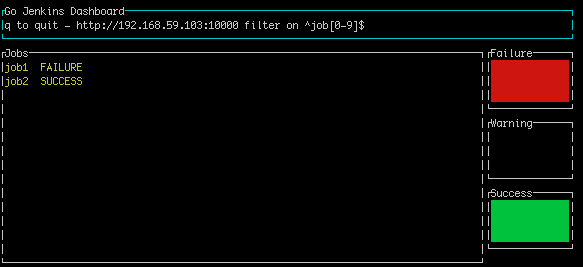

# goJenkinsDashboard
Jenkins Dashboard in console

Draft - WIP

## Usage
```
go build && ./goJenkinsDashboard.go -logtostderr=true -stderrthreshold=INFO -jenkinsUrl=http://192.168.59.103:10000
```

Filter on jobs : 
```

go build && ./goJenkinsDashboard.go -logtostderr=true -stderrthreshold=INFO -jenkinsUrl=http://192.168.59.103:10000 -filter=^job\[0-9\]$
```

Refreshing interval : 
```

go build && ./goJenkinsDashboard.go -logtostderr=true -stderrthreshold=INFO -jenkinsUrl=http://192.168.59.103:10000 -interval=2s
```

see examples on filter on http://play.golang.org/p/Mpl-NThwrS

## Screenshot

